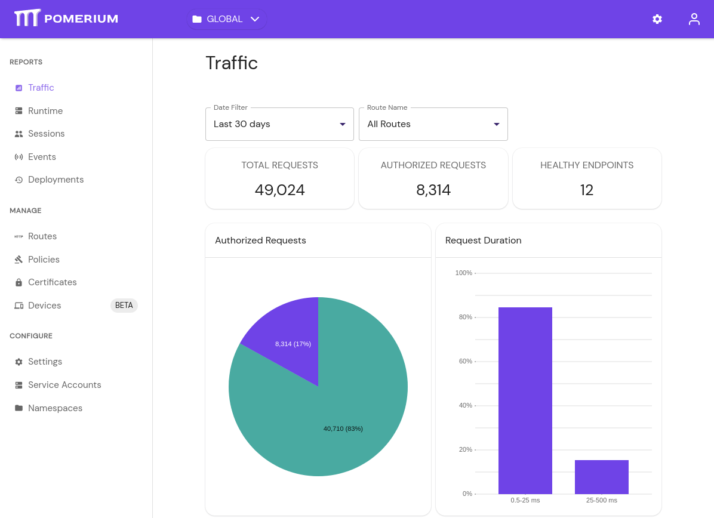

# Configure Metrics

Pomerium Enterprise uses Prometheus as a metrics collection back-end. You can configure Pomerium and the Console to talk to an existing Prometheus server, or configure the embedded Prometheus backend.

:::tip
For production deployments, we suggest using a dedicated Prometheus instance.
:::

## Prepare Pomerium

1. In the Pomerium `config.yaml`, define the [`metrics_address`](/docs/reference/metrics-address) key to a network interface and/or port. For example:

   ```yaml
   metrics_address: 192.0.2.31:9999
   ```

   The example above has Pomerium providing metrics at port `9999` on an IP address reachable by the Pomerium Console service.

   If you're running Pomerium Enterprise in a distributed environment where the IP address is not known at the time of deployment, you can use the resolvable FQDN of the Pomerium host (`pomerium0.internal.mycompany.com`, for example), or override this key with the environment variable `METRICS_ADDRESS`. We do not recommend exposing this endpoint to public traffic as it can contain potentially sensitive information.

## External Prometheus

1. Add the listener to your Prometheus configuration, usually via `prometheus.yml`:

   ```yaml
   - job_name: 'Pomerium'
      scrape_interval: 30s
      scrape_timeout: 5s
      static_configs:
         - targets: ['192.0.2.10:9999']

   ```

1. [Reload](https://prometheus.io/docs/prometheus/latest/configuration/configuration/#configuration) the Prometheus configuration:

   ```bash
   curl -i -XPOST path.to.prometheus:port/-/reload
   ```

1. In the Pomerium Enterprise `config.yaml` file, define the `prometheus_url` key to point to your Prometheus instance(s):

   ```yaml
   prometheus_url: http://192.168.122.50:9090
   ```

1. Restart the Pomerium and Pomerium Enterprise services. You should now see route traffic data in the Enterprise Console:

   

## Embedded Prometheus

To take advantage of Prometheus embedded in Pomerium Enterprise, edit `/etc/pomerium-console/config.yaml`:

```yaml
prometheus_data_dir: /var/lib/pomerium-console/tsdb
```

The directory path can be any location that the `pomerium` system user can write to. The example above uses the default location created by the [OS packages](/docs/enterprise/install/quickstart).
