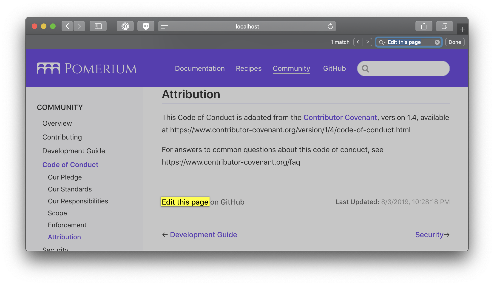

# Contributing

First of all, thank you for considering contributing to Pomerium! You can have a direct impact on Pomerium by helping with its code or documentation. To contribute to Pomerium, open a [pull request](https://github.com/pomerium/pomerium/pulls) (PR). If you're new to our community, that's okay: **we gladly welcome pull requests from anyone, regardless of your native language or coding experience.**

## General

We try to hold contributions to a high standard for quality, so don't be surprised if we ask for revisions--even if it seems small or insignificant. Please don't take it personally. If your change is on the right track, we can guide you to make it mergeable.

Here are some of the expectations we have of contributors:

- If your change is more than just a minor alteration, **open an issue to propose your change first.** This way we can avoid confusion, coordinate what everyone is working on, and ensure that changes are in-line with the project's goals and the best interests of its users. If there's already an issue about it, comment on the existing issue to claim it.

- **Keep pull requests small.** Smaller PRs are more likely to be merged because they are easier to review! We might ask you to break up large PRs into smaller ones. [An example of what we DON'T do.](https://twitter.com/iamdevloper/status/397664295875805184)

- **Keep related commits together in a PR.** We do want pull requests to be small, but you should also keep multiple related commits in the same PR if they rely on each other.

- **Write tests.** Tests are essential! Written properly, they ensure your change works, and that other changes in the future won't break your change. CI checks should pass.

- **Benchmarks should be included for optimizations.** Optimizations sometimes make code harder to read or have changes that are less than obvious. They should be proven with benchmarks or profiling.

- **[Squash](http://gitready.com/advanced/2009/02/10/squashing-commits-with-rebase.html) insignificant commits.** Every commit should be significant. Commits which merely rewrite a comment or fix a typo can be combined into another commit that has more substance. Interactive rebase can do this, or a simpler way is `git reset --soft <diverging-commit>` then `git commit -s`.

- **Own your contributions.** Pomerium is a growing project, and it's much better when individual contributors help maintain their change after it is merged.

- **Use comments properly.** We expect good godoc comments for package-level functions, types, and values. Comments are also useful whenever the purpose for a line of code is not obvious.

- **Recommended reading**

  - [CodeReviewComments](https://github.com/golang/go/wiki/CodeReviewComments)
  - [Linus Torvalds describes a good commit message](https://gist.github.com/matthewhudson/1475276)
  - [Best Practices for Maintainers](https://opensource.guide/best-practices/)
  - [Shrinking Code Review](https://alexgaynor.net/2015/dec/29/shrinking-code-review/)

## Docs

Pomerium's documentation is available at <https://www.pomerium.io/docs>. If you find a typo, feel a section could be better described, or have an idea for a totally new application or section, don't hesitate to make a pull request change. There are few ways you can do this.

### Simple edits

The easiest way to fix minor documentation issues in Pomerium is to click on "Edit this page in Github" on any page.



Doing so will create a [fork](https://help.github.com/en/articles/fork-a-repo) of the project, allow you to [update the page](https://guides.github.com/features/mastering-markdown/), and create a [pull request](https://help.github.com/en/articles/about-pull-requests).


### Bigger changes

If you need to add a new page, or would like greater control over the editing process you can edit the docs similar to how you would make changes to the source code.

#### Pre-reqs

We use [VuePress](https://vuepress.vuejs.org) to generate our docs. Vuepress is a simple, [markdown](https://v1.vuepress.vuejs.org/config/#markdown) and [Vue.js](https://v1.vuepress.vuejs.org/config/#markdown) based static site generator. Before building the docs, you'll need to install the following pre-requisites.

1. [Node.js](https://nodejs.org/en/download/).
2. [Yarn](https://yarnpkg.com/lang/en/docs).

#### Make changes

Once you have Nodejs and Yarn installed, simply run `make docs` in a terminal which will install any required node packages as well as start up a development server. You should see something like the below, with a link to the local doc server.

```bash
success [19:02:54] Build f9f5f7 finished in 246 ms! ( http://localhost:8081/ )
```

Once you have the development server up and running, any changes you make will automatically be reloaded and accessible in your browser.

To add a new document, simply add a new file with the `.md` markdown extension. For example, this document would be `docs/community/contributing.md`.

To add a new document to the side or top-bar navigation, see `docs/.vuepress/config.js` and add that document to the desired section.

### PR Previews

We use [Netlify](https://www.netlify.com) to build and host our docs. One of nice features of Netlify, is that a preview of the docs are automatically created for each new pull request that is made, which lets you be sure that the version of your docs that you see locally match what will ultimately be deployed in production.

[configuration variables]: /reference
[download]: https://github.com/pomerium/pomerium/releases
[environmental configuration variables]: https://12factor.net/config
[verify]: https://verify.pomerium.com/
[identity provider]: /identity-providers
[make]: https://en.wikipedia.org/wiki/Make_(software)
[tls certificates]: topics/certificates
