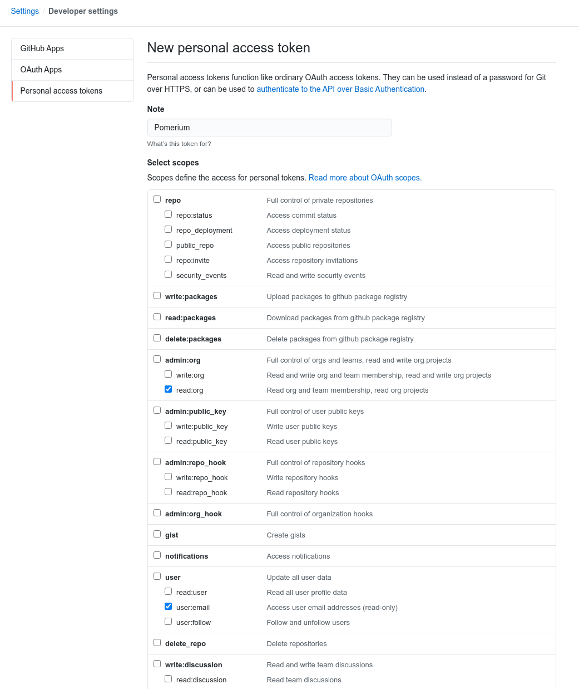

# GitHub

This document describes the use of GitHub as an identity provider for Pomerium. It assumes you have already [installed Pomerium](/install/)

::: warning
The [GitHub API] does not support [OpenID Connect], just [OAuth 2.0].
For this reason, it was challenging to implement revocation of a user's **Access Token** (a string representing the granted permissions) when they sign out from Pomerium's user info endpoint.
:::

In addition, the teams of the organization(s) a user belongs to, will be used as groups on Pomerium.

## Create a GitHub OAuth 2.0 Application

1. Log in to [Github](https://github.com/login) or create an account.

1. Navigate to your profile using the avatar on the navigation bar, and select **Settings**:

1. Navigate to **Developer settings ➞ OAuth Apps** and select **New OAuth App**.

  

1. Create a new OAuth2 application by filling the form fields above with the following parameters:

   | Field                       | Description                                                         |
   | --------------------------- | ------------------------------------------------------------------- |
   | Application name            | The name of your web app.                                           |
   | Homepage URL                | The homepage URL of the application to be integrated with Pomerium. |
   | Authorization callback URL  | `https://${authenticate_service_url}/oauth2/callback`, `authenticate_service_url` from your Pomerium configuration. |


1. After creating the application, select **Generate a new client secret** and save **Client Secret** along with the **Client ID**.

## Create a Service Account

To use `allowed_groups` in a policy, an `idp_service_account` needs to be set in the Pomerium configuration. The Service Account for GitHub should be a personal access token with `read:org` permissions

1. Create a new token at [github.com/settings/tokens/new](https://github.com/settings/tokens/new).

   

1. The format of the `idp_service_account` for GitHub is a base64-encoded JSON document:

   ```json
   {
   "username": "YOUR_GITHUB_USERNAME",
   "personal_access_token": "GENERATED_GITHUB_ACCESS_TOKEN"
   }
   ```

   You can save the object as a temporary file to encode:

   ```bash
   cat tmp.json | base64 -w 0
   ```

## Pomerium Configuration

After creating your GitHub OAuth application, update the **Pomerium** configuration:

:::: tabs
::: tab config.yaml
```bash
idp_provider: "github"
idp_client_id: "REDACTED"       // github application ID
idp_client_secret: "REDACTED"   // github application secret
idp_service_account: "REDACTED" // github service account (personal access token)
```
:::
::: tab Environment Variables
```bash
IDP_PROVIDER="github"
IDP_CLIENT_ID="REDACTED"       // github application ID
IDP_CLIENT_SECRET="REDACTED"   // github application secret
IDP_SERVICE_ACCOUNT="REDACTED" // github service account (personal access token)
```
:::
::::

Whenever a user tries to access your application integrated with Pomerium, they will be presented with a sign-on page as below:


[Github API]: https://developer.github.com/v3/#oauth2-token-sent-in-a-header
[openid connect]: https://en.wikipedia.org/wiki/OpenID_Connect
[OAuth 2.0]: https://auth0.com/docs/protocols/oauth2
