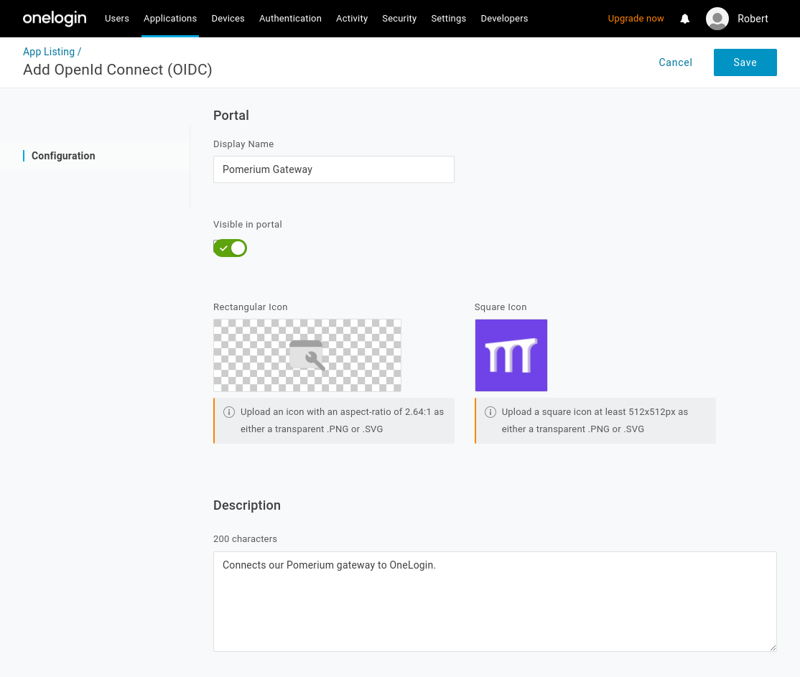
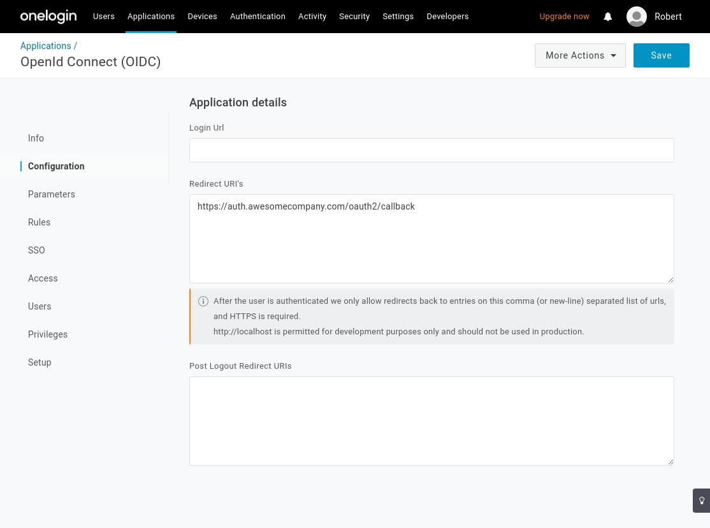
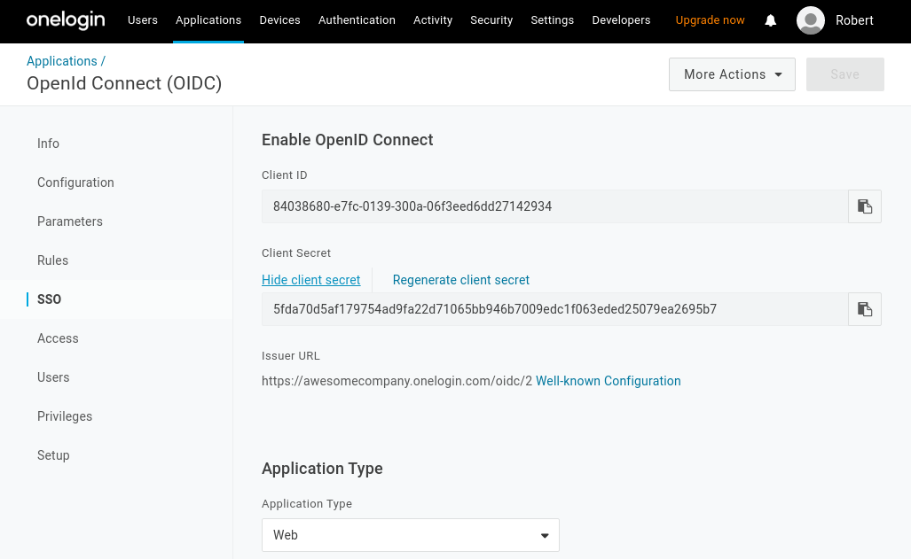
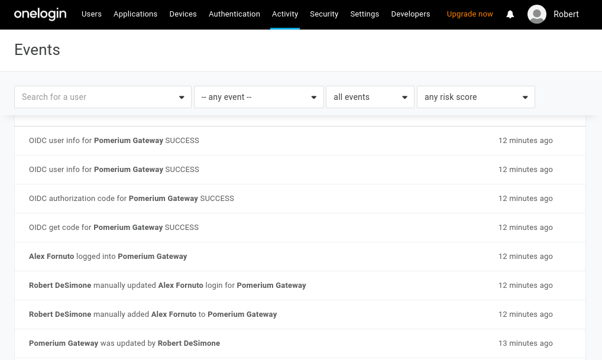

# OneLogin

This doc describes how to create an OIDC app in [OneLogin] for Pomerium and connect to it. It assumes you have already [installed Pomerium].

::: warning
While we do our best to keep our documentation up to date, changes to third-party systems are outside our control. Refer to [Connect an OIDC enabled app](https://developers.onelogin.com/openid-connect/connect-to-onelogin) from OneLogin's documentation as needed, or [let us know](https://github.com/pomerium/pomerium/issues/new?assignees=&labels=&template=bug_report.md) if we need to re-visit this page.
:::

## Create OpenID Connect App

1. Log in to your [OneLogin](https://www.onelogin.com/) account and click on **Administration** at the top.

1. Navigate to **Applications** on the top menu. Click the **Add App** button:

   

1. On the **Find Application** page, search for **openid**. Select **Openid Connect** by OneLogin, Inc.

   

1. On the App Configuration page, name the app and select a logo:

   

   Select **Save**.

1. From the **Configuration** tab, set set the **Redirect URI's** to Pomerium's redirect url (`https://${authenticate_service_url}/oauth2/callback`):

   

   Select **Save**.

1. Navigate to the **SSO** page. This section contains the **[Client ID]**, **[Client Secret]** and **[Identity Provider URL]** you'll use to configure Pomerium:

   

1. Set the application type to **Web** and the token endpoint to be **POST**.

1. Under **Token Timeout settings** set **Refresh Token** to 60 minutes (or whatever value makes sense for your organization). Note, however, if you don't enable refresh tokens the user will be prompted to authenticate whenever the access token expires which can result in a poor user experience.

   Select **Save** to complete the application configuration.

### Add Users

OneLogin will not make your new application accessible to members of your organization automatically. You can assign access to individual users (as shown below), or define rules / policies based on group membership.


## Service Account

To use `allowed_groups` in a policy, an `idp_service_account` needs to be set in the Pomerium configuration. The service account for OneLogin uses a *different* client ID and client secret from the one configured above.

1. From the **Administration** dashboard, navigate to **Developers → API Credentials** and select **New Credential**.

1. Name the new credential and rive it "Read users" access:


1. The format of the `idp_service_account` for OneLogin is a base64-encoded JSON document:

   ```json
   {
   "client_id": "...",
   "client_secret": "..."
   }
   ```

   You can save the object as a temporary file to encode:

   ```bash
   cat tmp.json | base64 -w 0
   ```

A [Group's ID](https://developers.onelogin.com/openid-connect/api/user-info) will be used to affirm user group membership.

## Pomerium Configuration

Update your Pomerium configuration:

:::: tabs
::: tab config.yaml
```yaml
idp_provider: "onelogin"
idp_provider_url: "https://awesomecompany.onelogin.com/oidc/2"
idp_client_id: "REDACTED" # Your OneLogin application ID
idp_client_secret: "REDACTED" # Your OneLogin application secret
idp_service_account: "REDACTED" # API credentials, base64-encoded
```
:::
::: tab Environment Variables
```bash
IDP_PROVIDER="onelogin"
IDP_PROVIDER_URL="https://awesomecompany.onelogin.com/oidc/2"
IDP_CLIENT_ID="REDACTED" # Your OneLogin application ID
IDP_CLIENT_SECRET="REDACTED" # Your OneLogin application secret
IDP_SERVICE_ACCOUNT="REDACTED" # API credentials, base64-encoded
```
:::
::::

After reloading Pomerium, you should be able to see any login events from your OneLogin events dashboard.



[client id]: /reference/readme.md#identity-provider-client-id
[client secret]: /reference/readme.md#identity-provider-client-secret
[Identity Provider URL]: /reference/readme.md#identity-provider-url
[environmental variables]: https://en.wikipedia.org/wiki/Environment_variable
[oauth2]: https://oauth.net/2/
[openid connect]: https://en.wikipedia.org/wiki/OpenID_Connect
[OneLogin]: https://www.onelogin.com/
[installed Pomerium]: install/