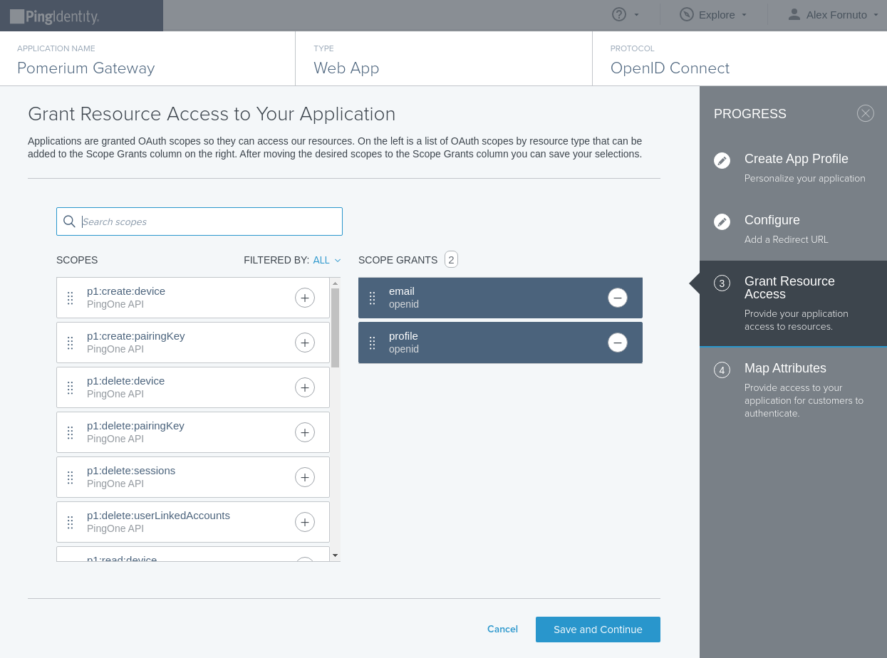
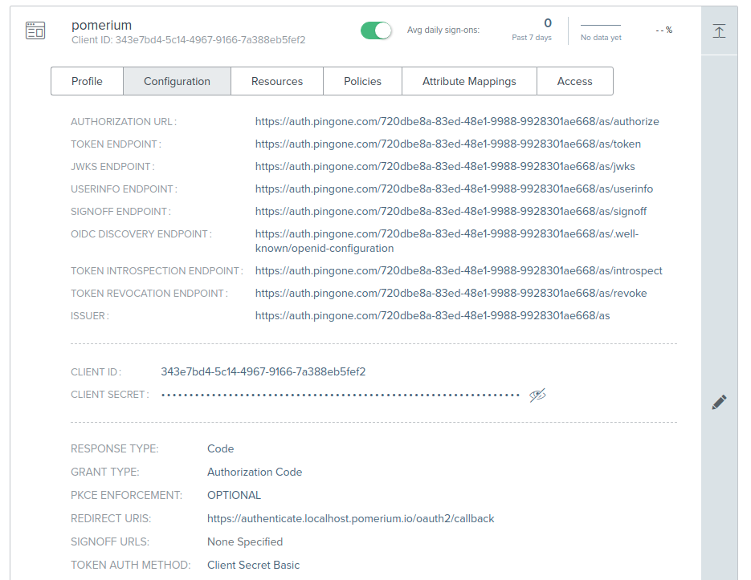
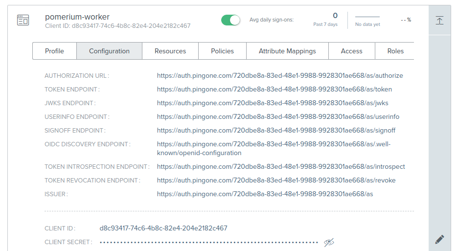

# Ping Identity

This document covers configuring Ping Identity as an IdP for your Pomerium gateway. It assumes you have already [installed Pomerium](/install/readme.md).

::: warning
While we do our best to keep our documentation up to date, changes to third-party systems are outside our control. Refer to [Adding an application - Web application](https://docs.pingidentity.com/bundle/p14c/page/lyd1583255784891.html) from Ping's documentation as needed, or [let us know](https://github.com/pomerium/pomerium/issues/new?assignees=&labels=&template=bug_report.md) if we need to re-visit this page.
:::

## Create OpenID Connect App

1. To use the Ping Identity provider, first go to the [Ping One](https://www.pingidentity.com/en/account/sign-on.html) console and select the environment you want to create the app for.

1. Click **Connections** in the side menu, select **Applications** and click **+** button to create a new application:

   

1. Select **WEB APP**, then **OIDC**:

   

1. Name the application and optionally provide a description and icon:

   

1. On the **Configure** page, add the Pomerium authenticate redirect URL. For example: `https://authenticate.localhost.pomerium.io/oauth2/callback`.

1. Provide the necessary scopes to your application as needed for your policies from the scopes available in the [OpenID Spec](https://openid.net/specs/openid-connect-core-1_0.html#ScopeClaims). Pomerium requires at least the `email` scope:

   

1. OIDC Attributes. **Save and Close**.

1. From the **Configuration** tab of your new application, note the values of the following keys to use in your Pomerium Configuration:

   * **ISSUER**: used as the `idp_provider_url` (e.g. `https://auth.pingone.com/720dbe8a-83ed-48e1-9988-9928301ae668/as`)
   * **CLIENT ID**: used as the `idp_client_id`
   * **CLIENT SECRET**: used as the `idp_client_secret`

   

1. Toggle the green slider to enable your new application.

## Service Account

To use `allowed_groups` in a policy, an `idp_service_account` needs to be set in the Pomerium configuration. The service account for Ping uses a *different* application, and client ID and client secret from the one configured above.

1. Click **Add Application**, but this time select **Worker → Worker App**.

   

1. Toggle the green slider to enable your new application.

1. This application's **Client ID** and **Client Secret** will be used as the service account in Pomerium.

   

   The format of the service account is a JSON encoded object with `client_id` and `client_secret` properties:

   ```json
   {
      "client_id": "XXXXXXXXXX",
      "client_secret": "XXXXXXXXXX"
   }
   ```

   You can save the object as a temporary file to encode as a base64 value:

   ```bash
   cat tmp.json | base64 -w 0
   ```

## Pomerium Configuration

Update your Pomerium configuration to use Ping as the IdP:

:::: tabs
::: tab config.yaml
```yaml
idp_provider: "ping"
idp_provider_url: "https://auth.pingone.com/720dbe8a-83ed-48e1-9988-9928301ae668/as"
idp_client_id: "CLIENT_ID"
idp_client_secret: "CLIENT_SECRET"
idp_service_account: "XXXXXXX" # Base64-encoded JSON
```
:::
::: tab Environment Variables
```bash
IDP_PROVIDER="ping"
IDP_PROVIDER_URL="https://auth.pingone.com/720dbe8a-83ed-48e1-9988-9928301ae668/as"
IDP_CLIENT_ID="CLIENT_ID"
IDP_CLIENT_SECRET="CLIENT_SECRET"
IDP_SERVICE_ACCOUNT="XXXXXXX" # Base64-encoded JSON
```
:::
::::