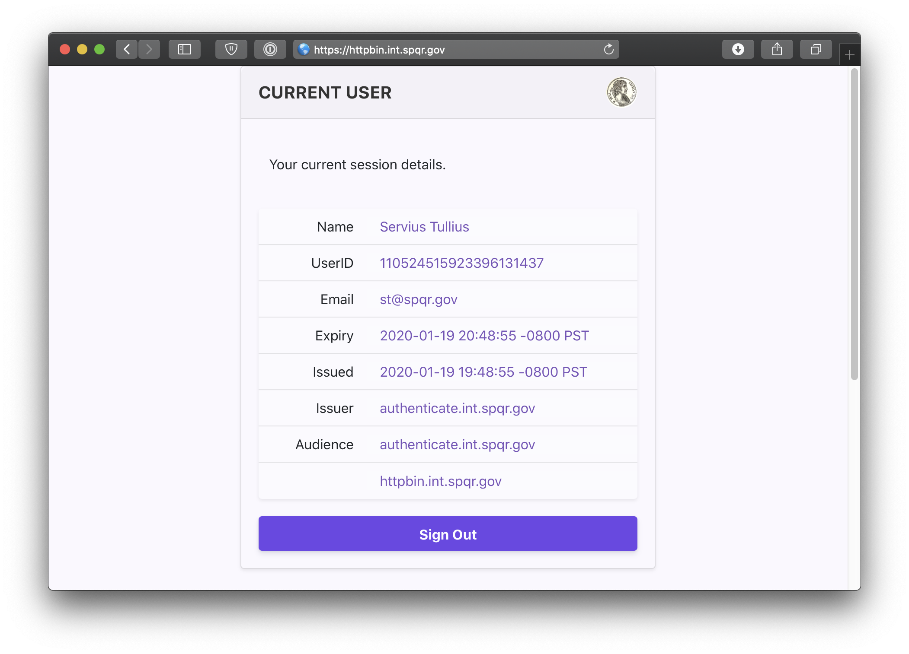

# Pomerium using Docker

In this quick-start document, we'll create a minimal but complete environment for running Pomerium with containers.

## Prerequisites

- A configured [identity provider]
- [Docker] and [docker-compose]
- [TLS certificates]
  - This document assumes that your local Docker environment does not have a fully qualified domain name (**[FQDN]**) routed to it, and that you followed [Self-signed wildcard certificate] to generate a locally trusted key pair. Otherwise, adjust the configurations below to match your certificate solution.

## Configure

1. Create a [configuration file] (e.g `config.yaml`) for defining Pomerium's configuration settings, routes, and access policies. Consider the following example:

   <<< @/examples/config/config.docker.yaml

   Keep track of the path to this file, relative to the `docker-compose.yml` file created in the next step. `docker-compose.yml` will need the correct relative path to your `config.yaml`.

1. Create or copy the following `docker-compose.yml` file and modify it to match your configuration, including the correct paths to your `config.yaml` and certificate files:

   <<< @/examples/docker/basic.docker-compose.yml

## Run

Run docker compose:

```bash
docker-compose up
```

Docker will automatically download the required [container images] for Pomerium and [verify]. Then, Pomerium will run with the configuration details set in the previous steps.

You should now be able access to the routes (e.g. `https://verify.localhost.pomerium.io`) as specified in your policy file.

You can also navigate to the special pomerium endpoint `verify.localhost.pomerium.io/.pomerium/` to see your current user details.



## Next Steps

Now you can experiment with adding services to Docker and defining routes and policies for them in Pomerium. See [Guides](/guides/readme) for help or inspiration.

:::caution This is a test environment!
If you followed all the steps in this doc your Pomerium environment is not using trusted certificates. Remember to use a valid certificate solution before moving this configuration to a production environment. See [Certificates][tls certificates] for more information.
:::

[configuration file]: reference/readme.md
[container images]: https://hub.docker.com/r/pomerium/pomerium
[docker]: https://docs.docker.com/install/
[docker-compose]: https://docs.docker.com/compose/install/
[verify]: https://verify.pomerium.com/
[identity provider]: ../identity-providers/readme.md
[tls certificates]: ../topics/certificates
[fqdn]: https://en.wikipedia.org/wiki/Fully_qualified_domain_name
[mkcert]: https://github.com/FiloSottile/mkcert
[Self-signed wildcard certificate]: topics/certificates#self-signed-wildcard-certificate