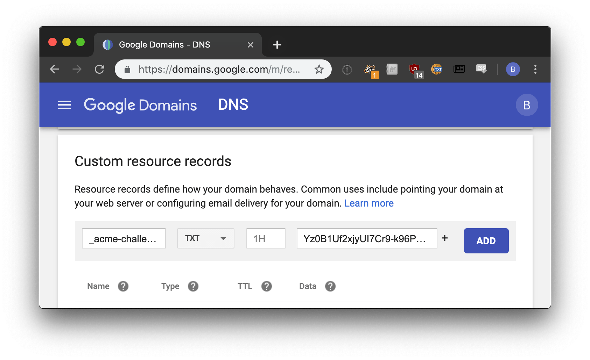
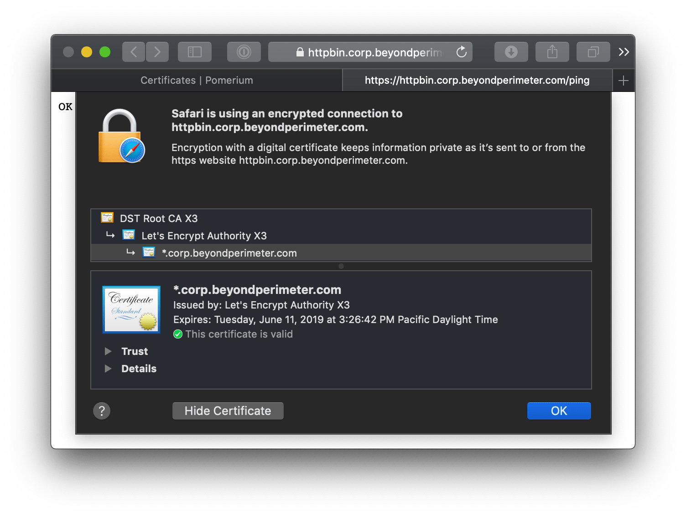
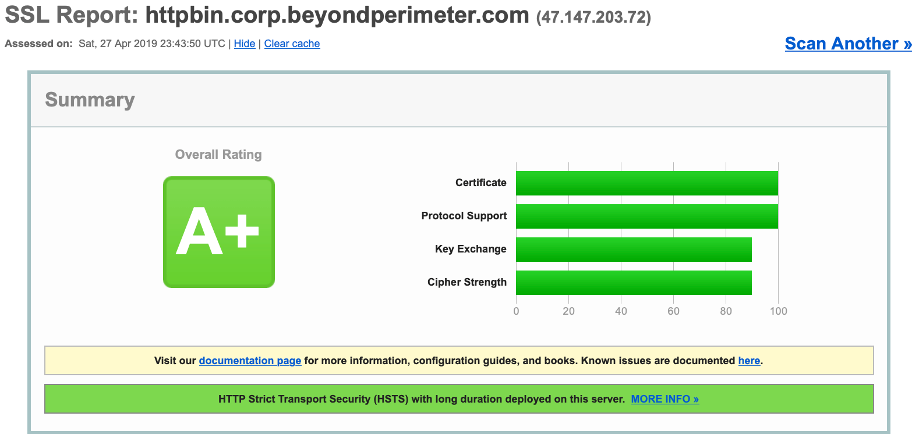

# Certificates

[Certificates](https://en.wikipedia.org/wiki/X.509) and [TLS](https://en.wikipedia.org/wiki/Transport_Layer_Security) play a vital role in [zero trust][principles] networks, and in Pomerium.

This document covers a few options in how to generate and set up TLS certificates suitable for working with pomerium.

This guide uses the following tools and resources:

- [LetsEncrypt](https://letsencrypt.org/about/) is a _public_ certificate authority that issues free certificates trusted by the major browsers. Other [private](https://blog.cloudflare.com/how-to-build-your-own-public-key-infrastructure/) or [public](https://scotthelme.co.uk/are-ev-certificates-worth-the-paper-theyre-written-on/) CAs would also be fine.
- [Google Domains](https://domains.google.com/) registrar will be used to set up our wildcard domain and certificate validation. But any registrar would do and some providers support [automatic renewal](https://github.com/Neilpang/acme.sh/wiki/dnsapi).
- [acme.sh](https://github.com/Neilpang/acme.sh) will be used to retrieve the wild-card domain certificate. Any [LetsEncrypt client](https://letsencrypt.org/docs/client-options/) that supports wildcard domains would work.

It should be noted that there are countless ways of building and managing [public-key infrastructure](https://en.wikipedia.org/wiki/Public_key_infrastructure). And although we hope this guide serves as a helpful baseline for generating and securing pomerium with certificates, these instructions should be modified to meet your own organization's tools, needs, and constraints. In a production environment you will likely be using your corporate load balancer, or a key management system to manage your certificate authority infrastructure.

## Why

Since one of Pomerium's core [principles] is to treat internal and external traffic impartially, Pomerium uses [mutually authenticated TLS](https://en.wikipedia.org/wiki/Mutual_authentication) ubiquitously. For example, Pomerium uses mTLS between:

- end-user and Pomerium
- Pomerium's services **regardless** of if the network is "trusted"
- Pomerium and the destination application

## Setting up DNS

First, you'll want to set a [CNAME](https://en.wikipedia.org/wiki/CNAME_record) record for wild-card domain name you will be using with Pomerium.


## Certificates

### Per-route automatic certificates

Pomerium itself can be used to retrieve, manage, and renew certificates certificates for free using Let's Encrypt, the only requirement is that Pomerium is able to receive public traffic on ports `80`/`443`. This is probably the easiest option.

```yaml
autocert: true
```

See the [Autocert] and [Autocert Directory] settings for more details.

### Self-signed wildcard certificate

In production, we'd use a public certificate authority such as LetsEncrypt. But for a local proof of concept or for development, we can use [mkcert](https://mkcert.dev/) to make locally trusted development certificates with any names you'd like. The easiest, is probably to use `*.localhost.pomerium.io` which we've already pre-configured to point back to localhost.

1. Install mkcert.

   :::: tabs
   ::: tab Go
   ```bash
   go get -u filippo.io/mkcert
   ```
   :::
   ::: tab Homebrew
   ```bash
   brew install mkcert
   ```
   ::::

1. Bootstrap mkcert's root certificate into your operating system's trust store.

   ```bash
   mkcert -install
   ```

1. Create your wildcard domain. `*.localhost.pomerium.io` is helper domain we've hard-coded to route to localhost:

   ```bash
   mkcert "*.localhost.pomerium.io"
   ```

### Manual DNS Let's Encrypt wildcard certificate

Once you've setup your wildcard domain, we can use acme.sh to create a certificate-signing request with LetsEncrypt.

<<< @/examples/sh/generate_wildcard_cert.sh

LetsEncrypt will respond with the corresponding `TXT` record needed to verify our domain.



It may take a few minutes for the DNS records to propagate. Once it does, you can run the following command to complete the certificate request process.

Here's how the above certificates signed by LetsEncrypt correspond to their respective Pomerium configuration settings:

Pomerium Config                | Certificate file
------------------------------ | --------------------------------------------------------------
[CERTIFICATE]                  | `$HOME/.acme.sh/*.corp.example.com_ecc/fullchain.cer`
[CERTIFICATE_KEY][certificate] | `$HOME/.acme.sh/*.corp.example.com_ecc/*.corp.example.com.key`

Your end users will see a valid certificate for all domains delegated by Pomerium.





::: warning

LetsEncrypt certificates must be renewed [every 90 days](https://letsencrypt.org/2015/11/09/why-90-days.html).

:::

## Resources

Certificates, TLS, and Public Key Cryptography is a vast subject we cannot adequately cover here so if you are new to or just need a brush up, the following resources may be helpful:

- [Why HTTPS for Everything?](https://https.cio.gov/everything/) The US government's CIO office has an excellent guide covering HTTPS and why future government sites will all be HTTPS.
- [Is TLS Fast](https://istlsfastyet.com/) debunks the performance myth associated with HTTPS.
- [Use TLS](https://smallstep.com/blog/use-tls.html) covers why TLS should be used everywhere; not just for securing typical internet traffic but for securing service communication in both "trusted" and adversarial situations.
- [Everything you should know about certificates and PKI but are too afraid to ask](https://smallstep.com/blog/everything-pki.html)

[autocert]: reference/readme.md#autocert
[autocert directory]: reference/readme.md#autocert-directory
[certificate]: reference/readme.md#certificates
[certificate_authority]: reference/readme.md#certificate-authority
[certificate_key]: reference/readme.md#certificates
[override_certificate_name]: reference/readme.md#override-certificate-name
[principles]: overview/background.md#history
[zero trust]: overview/background.md#zero-trust
